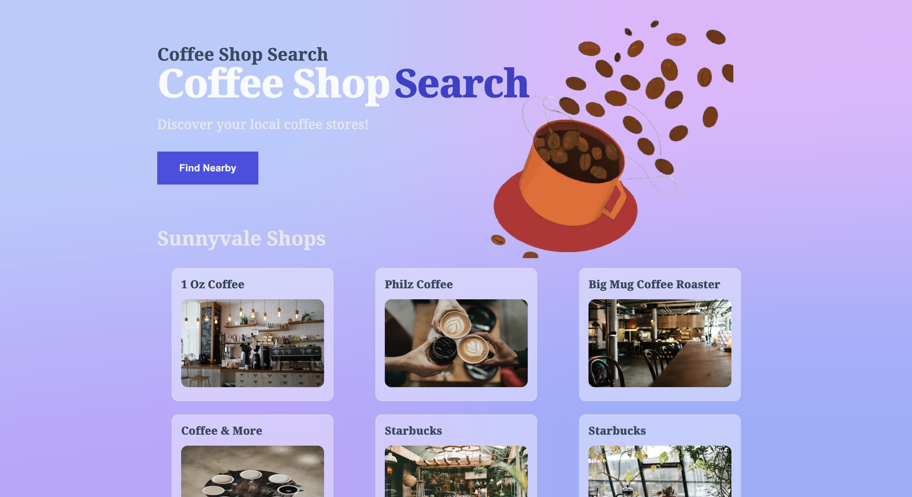

# ☕ Coffee Shop Search ☕

Coffee Shop Search is a comprehensive and interactive application that guides you to coffee shops in Sunnyvale, CA and other nearby locations of your choice. This project was built using Next.js and showcases various features that set it apart from Create-React-App.

## 🔍 Features 🔍

-   **Location-based Results**: By default, the app loads coffee shops in Sunnyvale, CA, and you can also search for coffee shops near your current location.
-   **Coffee Shop Details**: Clicking on a coffee shop takes you to a detailed page about the shop where you can view the address and upvote the shop.
-   **Beautiful Imagery**: Each coffee shop is paired with a delightful stock photo of coffee from the Unsplash API.
-   **Upvoting System**: Keep track of your favorite coffee shops by upvoting them. All votes are stored in Airtable.
-   **Artificial Intelligence**: The hero image was created using generative AI.
-   **Eye-Catching Design**: The application uses a background from meshgradient.com to add visual appeal.

## 🛠️ Built With 🛠️

-   [Next.js](https://nextjs.org/)
-   [Unsplash API](https://unsplash.com/developers)
-   [Foursquare Location API](https://developer.foursquare.com/)
-   [Airtable](https://airtable.com/)
-   Generative AI for hero image
-   [MeshGradient](https://www.meshgradient.com/)

This project was a great opportunity for me to learn about the unique features of Next.js, including a combination of client-side rendering and static site generation, which ensures a fast, responsive user experience.

## 🚀 How to Use 🚀

To use Coffee Shop Search, simply clone the repository, install dependencies, and execute npm run dev
